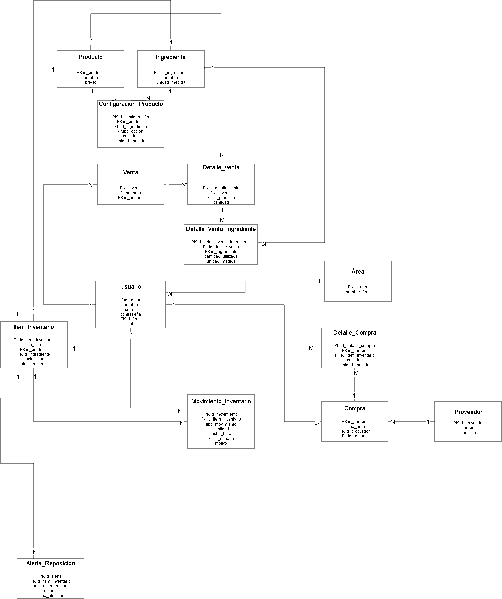

# Modelo Entidad-Relación Preliminar
## 1) Descripción
El modelo entidad-relación representa las principales entidades necesarias para modelar de manera clara y levantar el proceso de gestión de inventario definido en el modelo BPMN TO-BE.
El modelo considera el registro de productos e ingredientes, la configuración de los productos, las ventas, los movimientos de inventario, las compras, los usuarios y las alertas de reposición.

## 2) Entidades principales
Las entidades consideradas en el modelo son:
- Producto
- Ingrediente
- Configuracion_Producto
- Venta
- Detalle_Venta
- Detalle_Venta_Ingrediente
- Inventario_de_articulos
- Movimiento_Inventario
- Compra
- Detalle_Compra
- Proveedor
- Usuario
- Área
- Alerta_Reposicion
## 3) Relaciones y cardinalidades
- Producto 1:N Configuracion_Producto
- Ingrediente 1:N Configuracion_Producto
- Área 1:N Usuario
- Usuario 1:N Venta
- Venta 1:N Detalle_Venta
- Producto 1:N Detalle_Venta
- Detalle_Venta 1:N Detalle_Venta_Ingrediente
- Ingrediente 1:N Detalle_Venta_Ingrediente
- Producto 1:1 Inventario_de_articulos
- Ingrediente 1:1 Inventario_de_articulos
- Inventario_de_articulos 1:N Movimiento_Inventario
- Usuario 1:N Movimiento_Inventario
- Proveedor 1:N Compra
- Usuario 1:N Compra
- Compra 1:N Detalle_Compra
- Inventario_de_articulos 1:N Detalle_Compra
- Inventario_de_articulos 1:N Alerta_Reposicion
## 4) Trazabilidad con el proceso TO-BE
El modelo permite representar los principales elementos del proceso TO-BE. Los productos se relacionan con sus configuraciones de ingredientes, mientras que las ventas permiten identificar los productos vendidos y los ingredientes utilizados.
La entidad Inventario_de_articulos centraliza el stock de productos e ingredientes. Los movimientos de inventario permiten registrar entradas, salidas, mermas y ajustes, manteniendo un historial de los cambios realizados.
Las compras se relacionan con sus respectivos detalles y con los artículos de inventario ingresados. Por último, las alertas de reposición se generan a partir del nivel de stock de cada artículo.
De esta manera, el modelo de datos permite respaldar la actualización del inventario, el control de los niveles mínimos y el apoyo a las decisiones de reposición definidas en el proceso TO-BE.
## 5) Archivo del modelo
El modelo editable y su representación gráfica se encuentran en la carpeta assets/:

- er-preliminar.drawio
- er-preliminar.png
