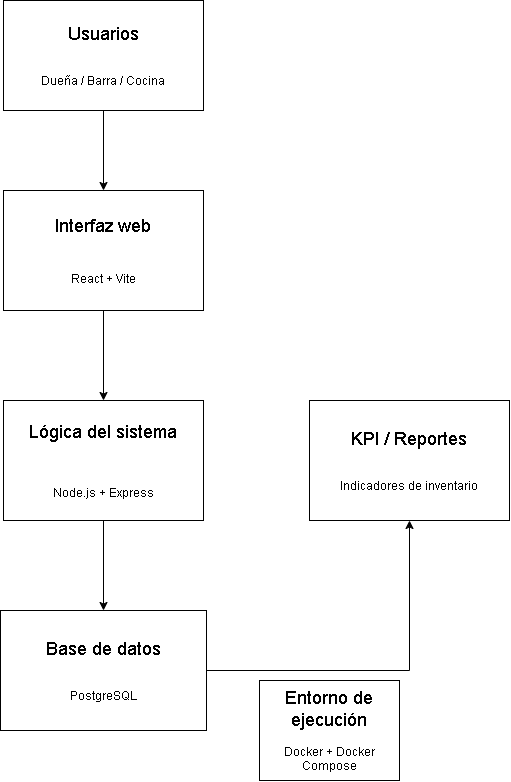

# Arquitectura lógica y stack tentativo
## 1) Arquitectura propuesta
La solución estará compuesta por una interfaz web, una lógica del sistema y una base de datos, que permitirán registrar las operaciones de inventario y mantener la información disponible para los usuarios.

## 2) Componentes
### Interfaz web
Se utilizará React + Vite para desarrollar la interfaz web, donde los usuarios podrán consultar y registrar información del sistema.
### Lógica del sistema
Se utilizará Node.js + Express para implementar la lógica del sistema y procesar las operaciones realizadas desde la interfaz.
### Base de datos
Se utilizará PostgreSQL para almacenar la información del sistema, incluyendo productos, ingredientes, ventas, inventario y movimientos.
### Indicadores clave de rendimiento (KPI) / Informes
La información almacenada permitirá obtener indicadores relacionados con la gestión de inventario para apoyar la toma de decisiones respecto a compras y actualización de productos en stock.
### Entorno de ejecución
Se utilizará Docker + Docker Compose para facilitar la ejecución del sistema en un entorno local reproducible.
## 3) Stack tentativo para la Entrega 2
- Frontend: React + Vite
- Backend: Node.js + Express
- Base de datos: PostgreSQL
- Entorno de ejecución: Docker + Docker Compose
